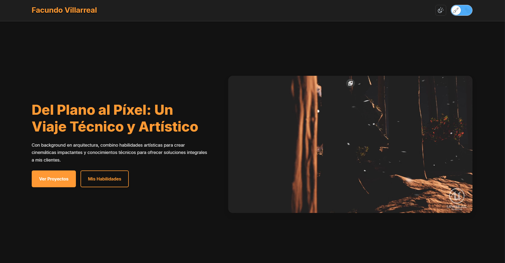

# 🌐 PortfolioTechArt - Facundo Villarreal

Este repositorio contiene la primera versión de mi portfolio web personal, desarrollado desde cero utilizando tecnologías base como **HTML**, **CSS**, y **JavaScript**, con un enfoque claro en **UX/UI**, **performance**, y **estructura modular**.

---

## 🎯 Objetivo del Proyecto

Mi propósito fue crear un espacio digital que represente de forma equilibrada **mi perfil técnico y artístico**, inspirado en los valores del rol de **Technical Artist**. Esto se traduce en una plataforma que permita visualizar:

- 🎨 *Cinemáticas, composiciones, shaders interactivos y recursos visuales*
- 🧠 *Automatización, lógica en Blueprints, snippets de código y herramientas técnicas*

Para ello, implementé un sistema de **switch de perfil (Artístico / Técnico)**, además del tradicional **modo claro / oscuro**, permitiendo al observador cambiar el enfoque del portfolio en tiempo real.

---

## 🚀 Características Clave

- ✨ **Modularización de código**: Cada funcionalidad está dividida en módulos `JS` independientes bajo `/modules`, anticipando una futura migración a **React**.
- 🌒 **Switch de tema claro/oscuro/sistema** con SVGs dinámicos accesibles y persistencia en `localStorage`.
- 🎭 **Switch de perfil Técnico/Artístico**, que modifica tanto estilos como contenido mostrado (`snippets`, layout, color, tono).
- 🎞️ **Slider de imágenes interactivo** en cada proyecto.
- 🧠 **Timeline** dinámico renderizado desde JSON, dividido en:
  - `Eventos pasados` (educación, experiencias)
  - `Objetivos futuros` (con checkboxes visuales no interactivos)
- 📹 **Video de cabecera embebido desde Vimeo**, con reproducción automática.
- 🌐 **Botones sociales** inyectados desde JSON con SVGs en línea, accesibles, escalables y responsive.
- 💬 **Formulario de contacto desplegable**, 100% funcional via Formspree.
- 📱 **Diseño responsive** para todas las relaciones de aspecto: mobile, tablets, monitores 16:9, y 2K/4K.
- ⚙️ **Performance optimizada** con Lighthouse:  
  - Desktop: `Performance 100`, `SEO 100`, `Accesibilidad >95`
  - Mobile: `Performance >73`, con mejoras en curso

---

## 🧩 Arquitectura y Proyección

Aunque el sitio está desarrollado con tecnologías "vanilla", todo fue diseñado con una **mentalidad escalable**:

- El código CSS sigue una estructura mantenible y comentada por secciones.
- Los archivos JSON (`projects.json`, `timeline.json`, `social.json`) desacoplan la lógica de contenido.
- Se favorece la legibilidad, la accesibilidad y el mantenimiento en cada sección.

🛠️ El próximo paso será refactorizar el proyecto usando **React + TailwindCSS**, aprovechando:

- Componentes reutilizables
- Hooks de estado para gestión de modo tema/perfil
- `Context API` o Zustand para persistencia de estado global
- `Framer Motion` para animaciones más fluidas
- `Astro` o `Next.js` si se requiere SSR o rendimiento extremo

---

## 🧠 Metodología de Aprendizaje

Este proyecto forma parte de mi **Zettelkasten personal**, un sistema de gestión del conocimiento en el que documento cada decisión, problema y solución aplicada.

### Log de aprendizaje:

- `18/04/2025`: Comienzo de la cursada en la materia de Front End de la Tecnicatura en Desarrollo de Software dictada por Javier Rodriguez Gallardo.
- `28/05/2025`: Primer prototipo con HTML y CSS. Estructura semántica. Implementación de sliders con ayuda de LLMs.
- `31/05/2025`: Primeros toggles de tema. Experimentación con SVGs. UX/UI para modos.
- `06/07/2025`: Sistema modular completo. Carga dinámica de proyectos y timeline. Refactorización de CSS.
- `09/07/2025`: Optimización con PageSpeed, revisión de contraste, accesibilidad y performance móvil.

---

## 🧪 Stack Tecnológico

| Tecnología | Uso |
|------------|-----|
| HTML5 / CSS3 / JS | Base del sitio |
| JSON | Contenido externo desacoplado |
| Formspree | Envío de formularios |
| Vimeo | Hosting de video |
| Lighthouse | Medición de performance |
| GitHub Pages | Hosting gratuito |

---

## 📎 Enlaces útiles

- 🔗 [Portfolio Online](https://facu041294.github.io/PortfolioTechArt/)
- 💻 [Repositorio en GitHub](https://github.com/facu041294/PortfolioTechArt)
- 🧑‍🎨 [ArtStation](https://www.artstation.com/facu041294)
- 👔 [LinkedIn](https://www.linkedin.com/in/facundovillarreal)

---

## 📩 Contacto

Si te interesa mi perfil técnico y artístico, podés contactarme desde el formulario en la sección "Conectemos", o vía [LinkedIn](https://www.linkedin.com/in/facundovillarreal).

---

## ⚖️ Licencia

Este proyecto es de uso personal con fines educativos y profesionales. Todos los assets y contenido pertenecen a Facundo Villarreal. El código puede consultarse para fines de aprendizaje.

---

> _"Del plano al píxel: un viaje técnico y artístico."_  
> — Facundo Villarreal
